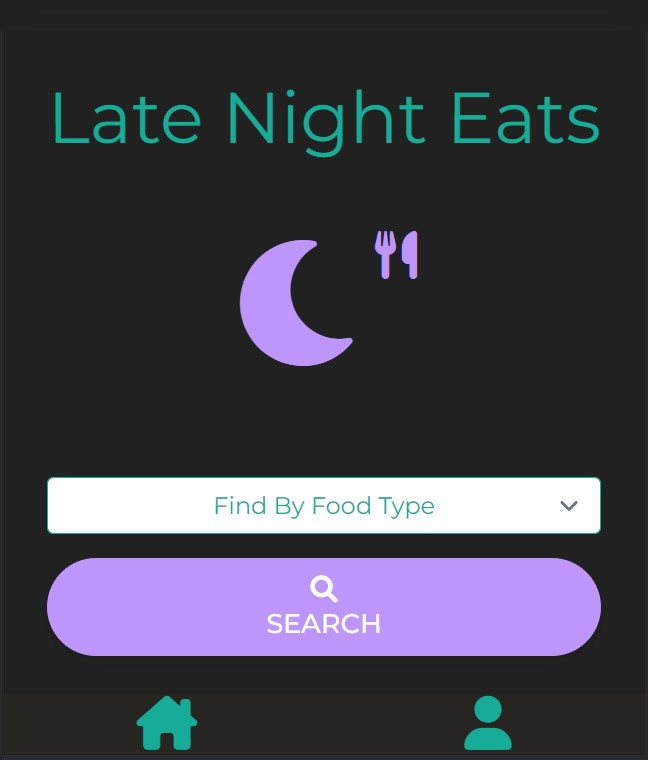

 # 🌛 Late Night Bites

 
  
  
  
  
  
  
  

  ------------------------------
## 🍔 Description

  Ever have a hard time deciding what to what to eat late at night? Ever have trouble finding places open that late anyway? Late Night Bites is just the thing for you!   
  This MERN stack single-page application is designed to collect user's data on their favorite late night restaurants, sort them by category, and allow other members to provide feedback in the form of comments and a voting system (voting system TBA).

  -----------------------------

  ## 💻 Website 

  [Click Here](https://late-nite-bites.herokuapp.com/) to go the deployed website

  

    
  

--------------------

## License and Authors

MIT License   
Copyright (c) [2022] by 

* [Sheroo Bhagia](https://github.com/GreenmanAustin)
* [David Ramm](https://github.com/DRamm1)
* [John Yoder](https://github.com/grayweling)
* [Lauren Yoder](https://github.com/lrodenyoder)
